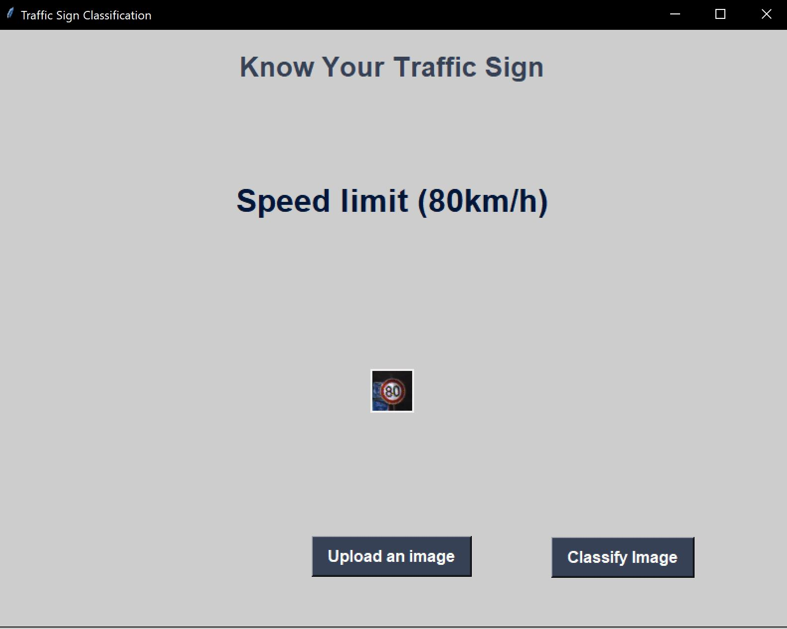

<h1 align="center"> Traffic Signs Recognition <h1/>

## Table of contents
- [Project Description](#Description)
- [DataSet Link](#DataLink)
- [Data Overview](#Data_Overview)
- [Required Packages](#Packages)
- [Demo Links](#Demo)

## Project Description
In the world of Artificial Intelligence and advancement in technologies, many researchers and big companies like Tesla, Uber, Google, Mercedes-Benz, Toyota, Ford, Audi, etc are working on autonomous vehicles and self-driving cars. So, for achieving accuracy in this technology, the vehicles should be able to interpret traffic signs and make decisions accordingly.

## DataSet Link:
> Kagle: https://www.kaggle.com/datasets/meowmeowmeowmeowmeow/gtsrb-german-traffic-sign

## Data Overview
- The dataset contains more than 50,000 images of different traffic signs. 
- It is further classified into 43 different classes. 
- The dataset is quite varying, some of the classes have many images while some classes have few images. 
- The size of the dataset is around 600 MB. 
- The dataset has a train folder which contains images inside each class and a test folder which we will use for testing our model.

 
Our ‘train’ folder contains 43 folders each representing a different class. 

## Required Packages:

- Python3
- Numpy
- matplotlib
- Sklearn
- Image
- Tensorflow
- Keras

## Demo Links:

> DeepNote Link:- https://deepnote.com/@nadersalama-lucifer/Traffic-Sign-Recognition-d1ff4ae7-9d69-4eb8-96c8-4ddbfbe85b0b

### Download & run __Classifier.py with h5 file in folder__ to try it out.
